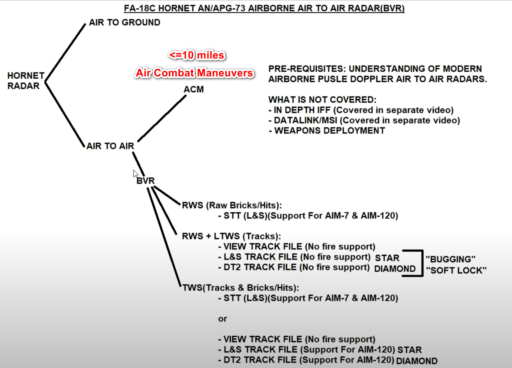

# F/A-18 BVR

#### Chart In General

### Source

[[YouTube]FA-18C Hornet: Air To Air BVR Radar (RWS/LTWS/TWS) Tutorial \| DCS WORLD by Grim Reapers](https://www.youtube.com/watch?v=J7JCI3_L0JE&t=356s)

#### From 6:16, it's about departure procedure