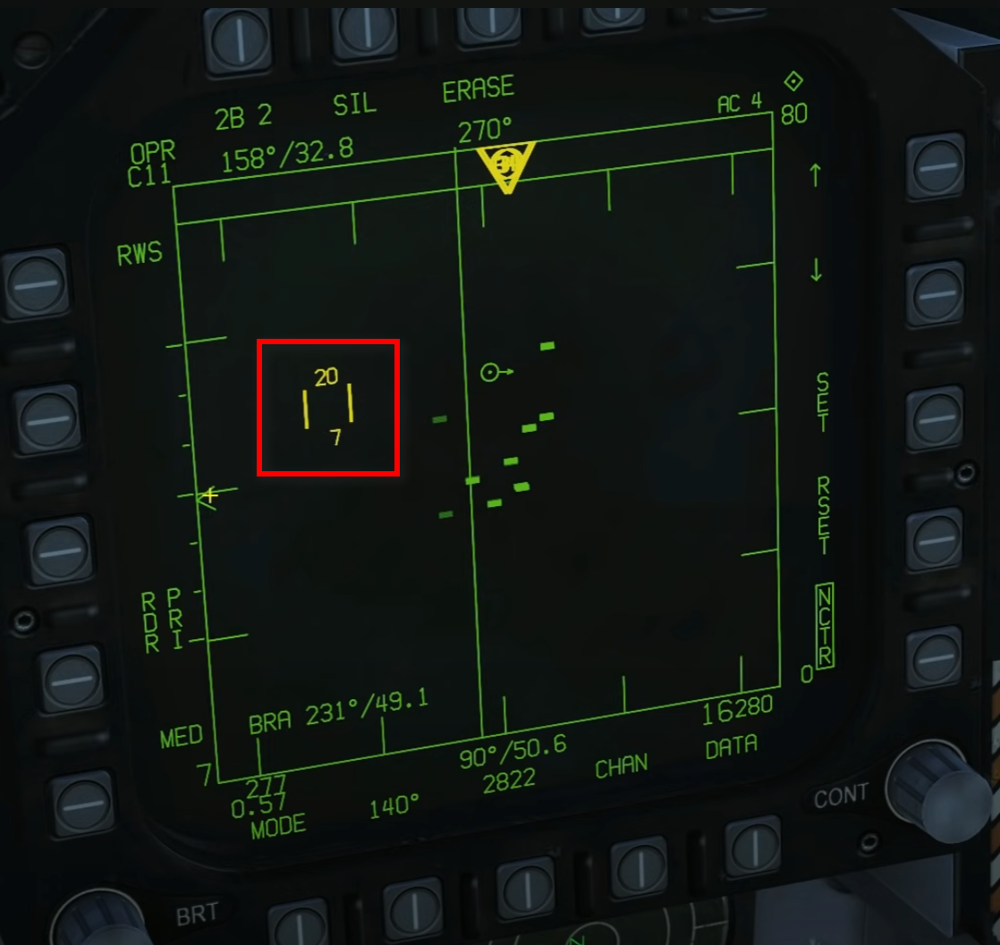

# F/A-18 BVR

## Chart In General

#### Key Bindings

#### TDC Range

- At Top + 20 k feets

- At Bottom + 7 k feets

#### Change Elevation Coverage of Radar

2B 1: Remember 1 Bar is About 1.3 Degrees.

## Three BVR Modes:

#### RWS - incl. STT (L&S)(Support For AIM-7 & AIM-120)

#### RWS + LTWS (Tracks)

- VIEW TRACK FILE (No Fire Suppport)

- L&S TRACK FILE (No Fire Suppport) STAR

- DT2 TRACK FILE (No Fire Suppport) DIAMOND

(Bugging Soft Lock For 2,3)

#### TWS

- incl. STT (L&S)(Support For AIM-7 & AIM-120)

- or 

- VIEW TRACK FILE (No Fire Suppport)

- L&S TRACK FILE (Support For AIM-120) STAR

- DT2 TRACK FILE (Support For AIM-120) DIAMOND

### Source

[[YouTube]FA-18C Hornet: Air To Air BVR Radar (RWS/LTWS/TWS) Tutorial \| DCS WORLD by Grim Reapers](https://www.youtube.com/watch?v=J7JCI3_L0JE&t=356s)

#### From 6:16, it's about departure procedure