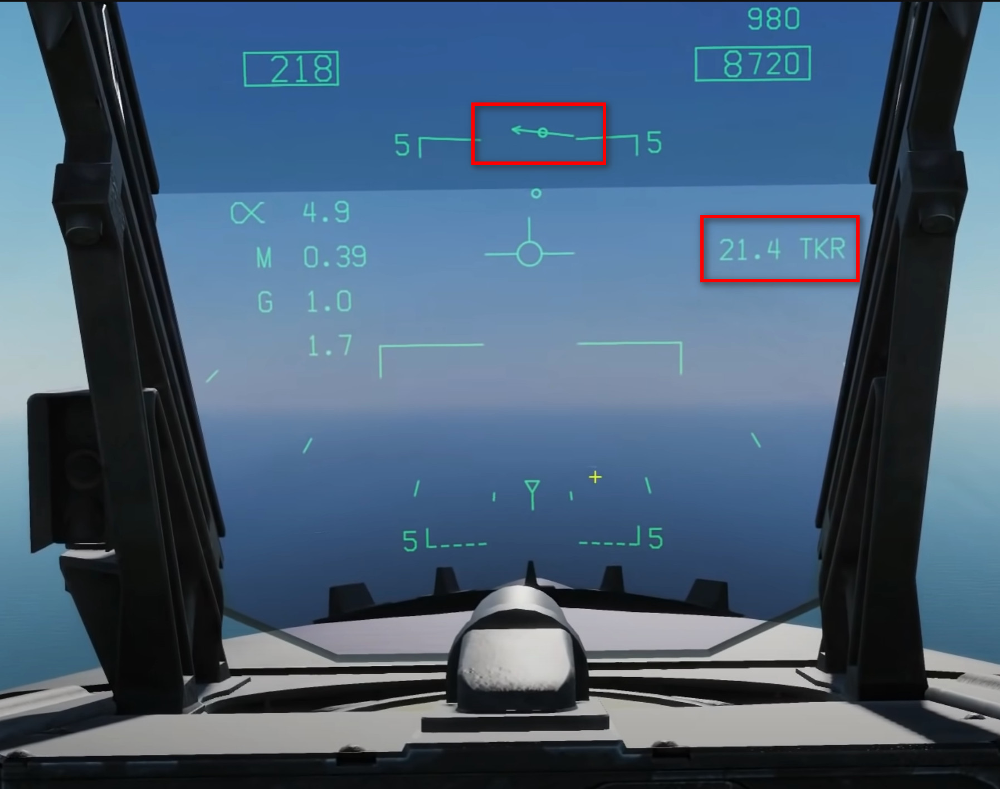

# F/A-18 Carrier Landing Case I

### F/A-18 Carrier landing circuit:

### F/A-18 Carrier landing case I/II/III explains:

  <li>1. Case I departures and recoveries are utilized during daytime operations (day ops) when weather conditions are VMC. Case I weather requires the ceiling to be no lower than 3,000 feet and not less than 5 NM visibility.</li>
  
  <li>2. Case II operations are utilized during day ops when it is anticipated the aircraft may enter IMC. Case II weather requires the lowest ceiling to be 1,000 feet or above and 5 NM visibility. Case II is normally called for when an overcast layer is present.</li>
  
  <li>3. Case III weather is any ceiling below 1,000 feet or a visibility less than 5NM. All night operations are conducted under Case III. For the purpose of determining Case III operations, night is defined as 30 minutes prior to sunset until 30 minutes after sunrise.</li>

### Operation Steps:

#### Set LDDI to HSI View

  

 

#### Turn on and setup TCN

 

 

#### HSI - Carrier Mark and distance from the aircraft

#### Set Course (plus 10 degree for runway vs. carrier course)

#### Landing Information on HSI and HUD

 

### Source

[Youtube: FA-18C Hornet: Carrier CASE 1 Approach & Landing Tutorial \| DCS WORLD by Grim Reapers](https://www.youtube.com/watch?v=MnQYhNI5j9o)

#### From 4:19, it's about comm setup.