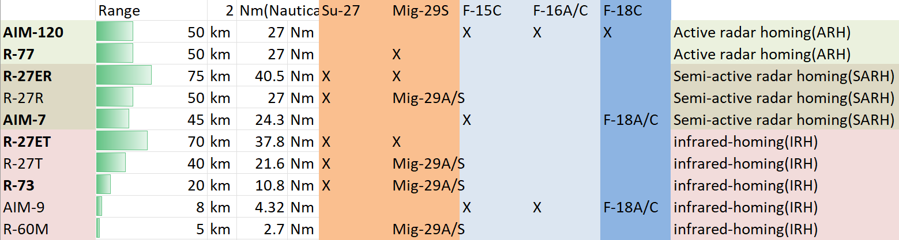
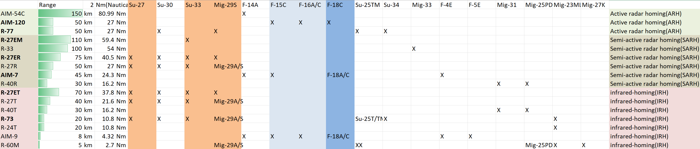

# Cheat Sheet

### Fox

##### Fox-1 (半主动雷达制导)

Indicates launch of a semi-active radar homing missile (such as the AIM-7 Sparrow).

##### Fox-2 (红外制导)

Indicates launch of an infrared homing missile (such as the AIM-9 Sidewinder).

##### Fox-3 (主动雷达制导)

Indicates launch of an active radar homing missile (such as the AIM-120 AMRAAM).

