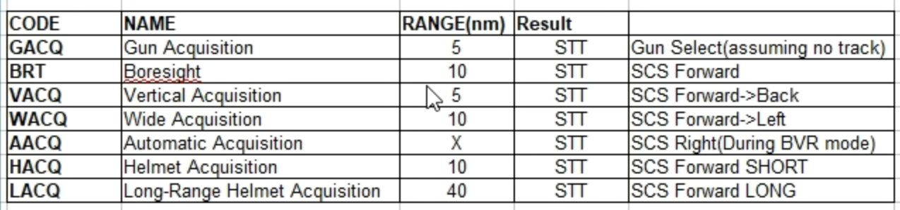

# Cheat Sheet

### Fox

##### Fox-1 ARH - Active radar homing (半主动雷达制导)

Indicates launch of a semi-active radar homing missile (such as the AIM-7 Sparrow).

##### Fox-2 SARH - Semi-active radar homing (红外制导)

Indicates launch of an infrared homing missile (such as the AIM-9 Sidewinder).

##### Fox-3 IRH - infrared-homing (主动雷达制导)

Indicates launch of an active radar homing missile (such as the AIM-120 AMRAAM).

##### ACM HOTAS Cheat Sheet

