# F/A-18 SA Page, Datalink & IFF Tutorial

## Basic Setup For Three DDIs

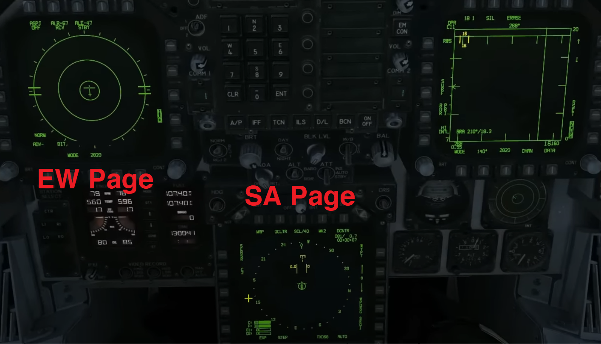

#### Turn On DataLink & IFF

##### What is IFF? - Identification Friend or Foe (IFF)

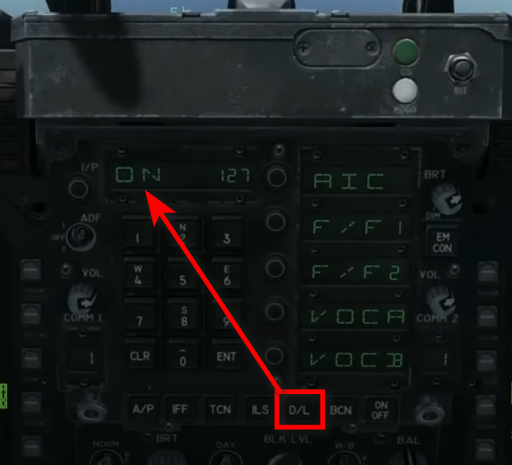

#### Move to Attact Radar, Make Sure NCTR is Checked.

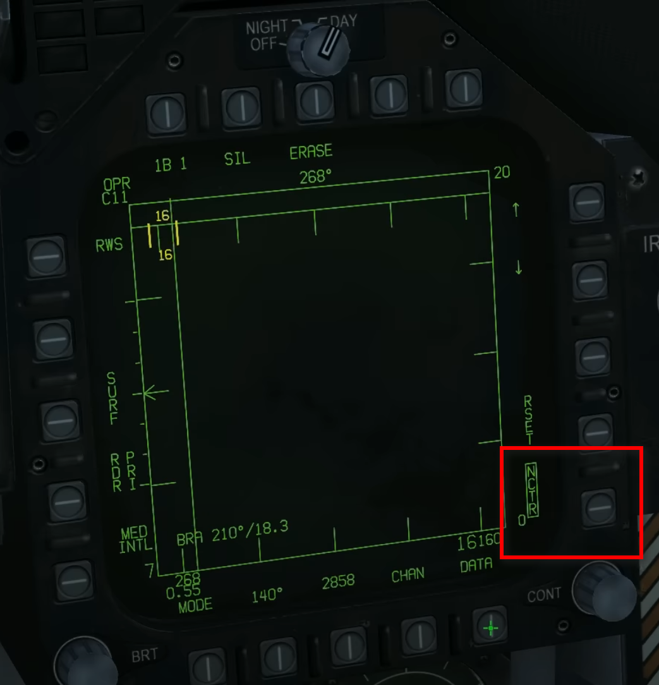

#### Go Into DATA, Make Sure LTWS Unchecked.

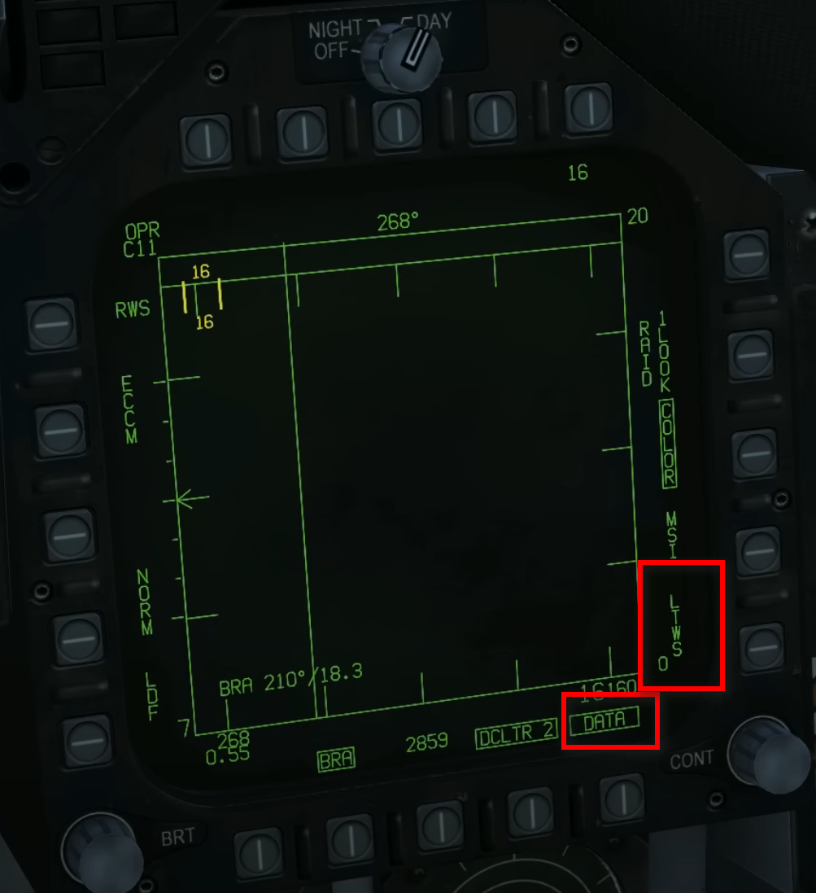

## Bullseye Setup

#### Go to HSI & To DATA

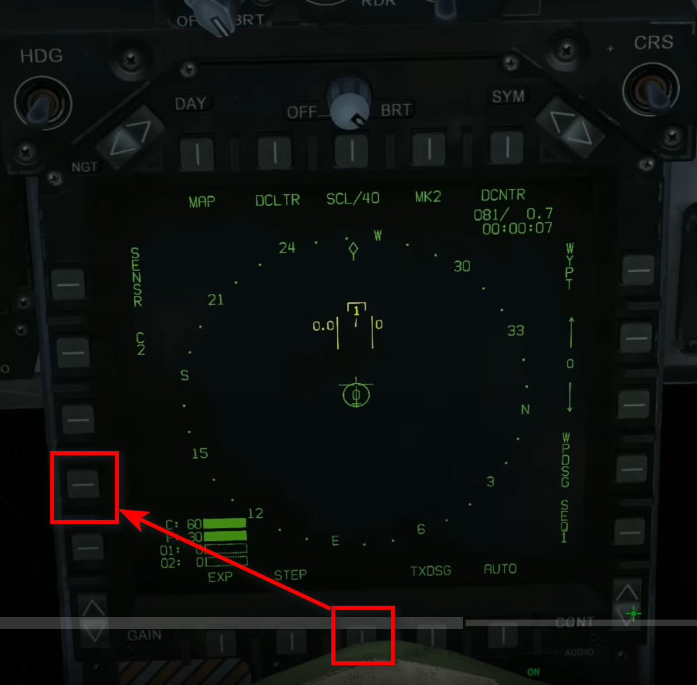

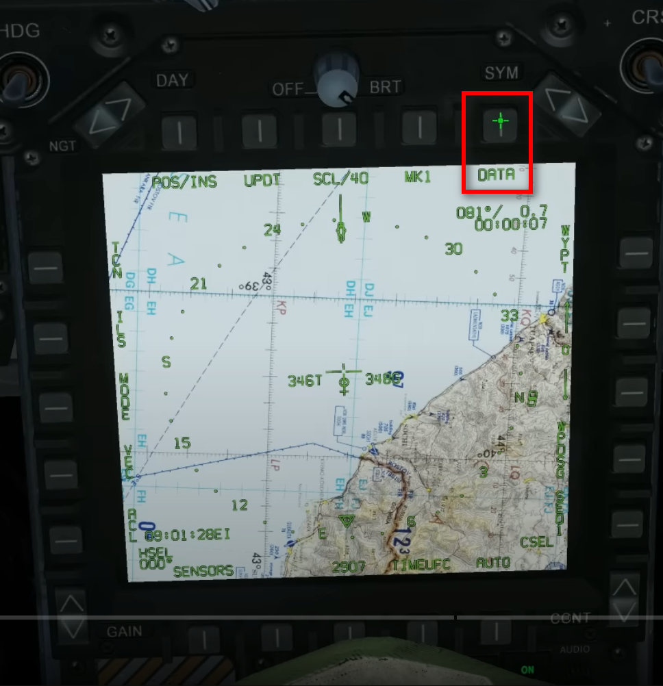

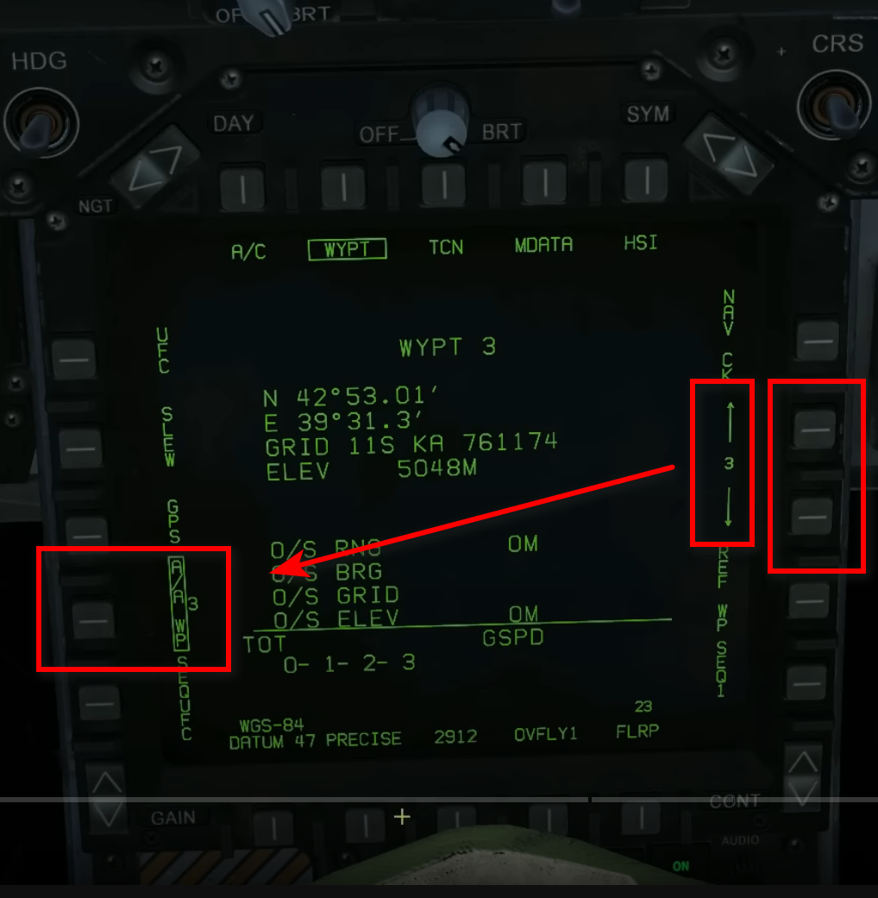

#### Show Bullseye Info

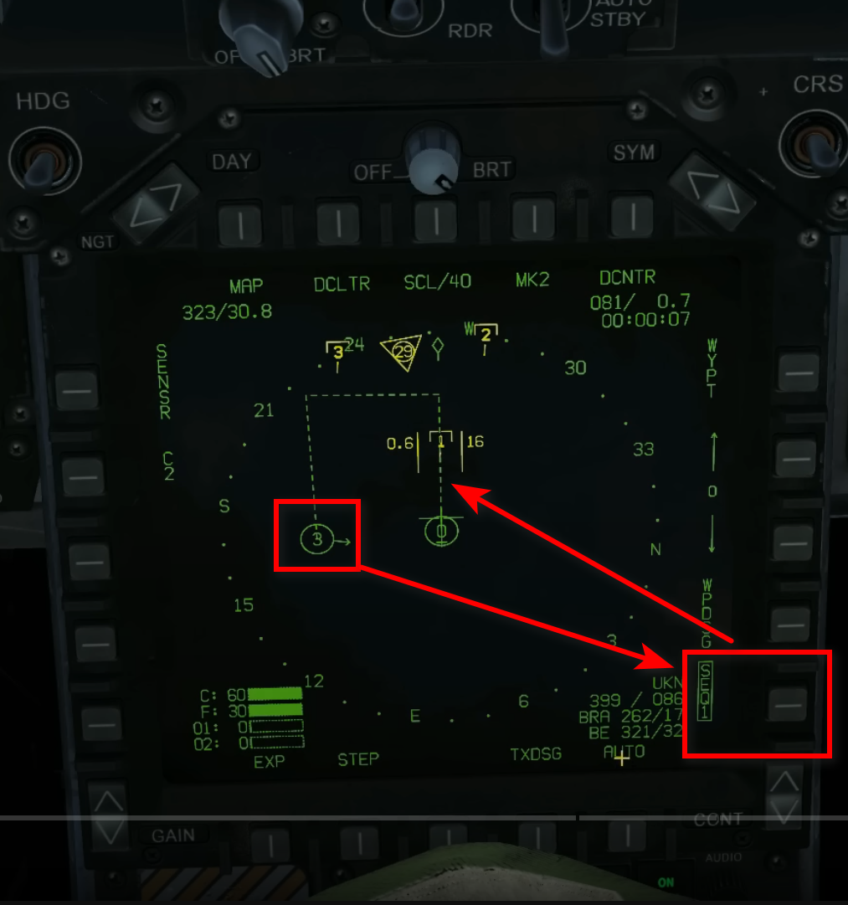

#### Go into Sensor Menu

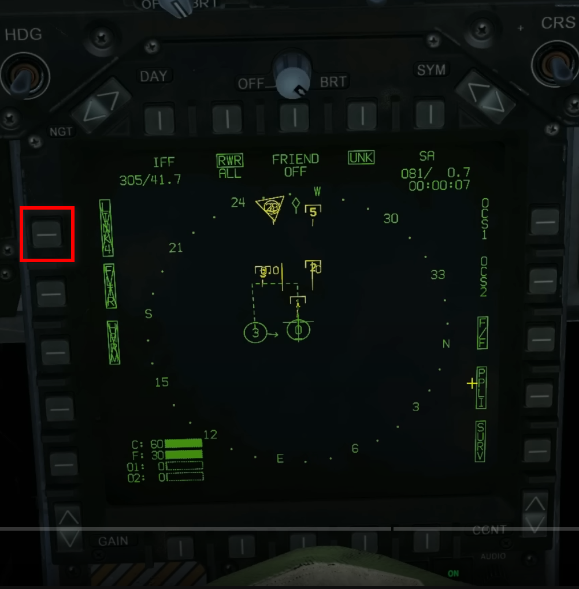

- SURV - Surveillance Data e.g. AWACS Aircrafts

- PPLI - Precise Participant Location and ID - Data From EG Fighter or AWACS

- F/F - Fighter To Fighter, Data From Fellow Fighters

- Colors:

1. Yellow: Unknown

2. Red: Hostile

3. Green: Friendly

- Shapes:

1. Half Square: Unknown

2. Chevron: Hostile

3. Dome: Friendly

- Numbers: Threaten Ranks, 1 is Hightest

- Upper Half: Data From Our Own Center (Attack Radar)

- Lower Half: Data From A Datalink Partner or AWACS etc.

#### IFF

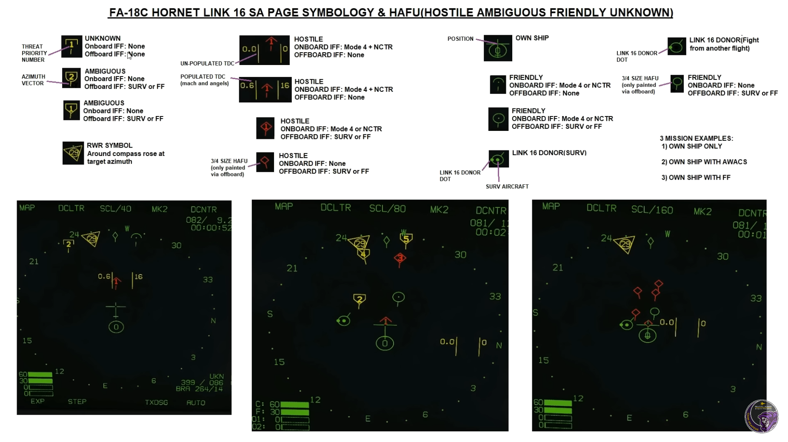

RWR has no range information, so always show up around the outer circle.

#### Target Info

- 399/086: Target on TDC: Speed(399 knots) and Heading(086 Degree) 

- BRA 275/35: Info Relative To Us: 275 Degree & 35 Miles

- BE 311/49: Bullseye to me: 311 Degree & 49 Miles

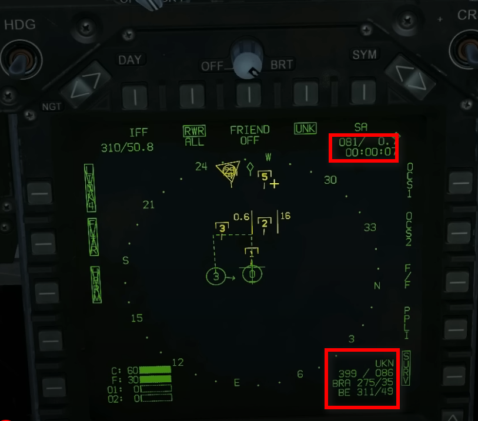

- 0.6 | | 16: Mach and angle: 0.6 Mach || 16 Heading

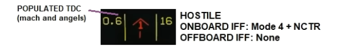

#### Above Content Til 26:00 Of The Source Video Tutorial. Content After 26:00 Unwatched.

### Source

[[YouTube]FA-18C Hornet: SA Page, Datalink & IFF Tutorial \| DCS WORLD by Grim Reapers](https://www.youtube.com/watch?v=GwEnRetJSP0&t=349s)
